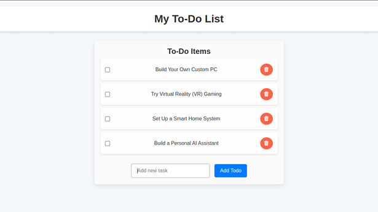
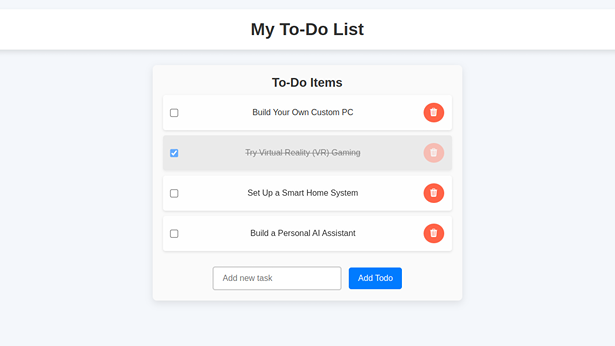
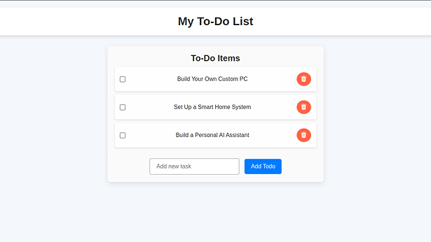

# Todo App

Welcome to the Todo App! 🎉 A simple way to organize your tasks and stay productive. Whether it's a quick note or a long-term project, this app makes it easy to add, complete, and delete your to-dos with a smooth and interactive experience. Keep track of everything you need to do while enjoying a clean and efficient user interface!

## Key Features

✨ **View Your Todo List**  
Keep track of everything in one place. Check out all your to-dos at a glance!

✨ **Add New Todos**  
Got a new task? Just type it in, hit "Add Todo", and voila! It's added to your list.

✨ **Mark Todos as Completed**  
Finished a task? Just check the box, and the task will be marked as completed. It’s that easy!

✨ **Delete Todos**  
No more clutter! Delete tasks once you're done with them by clicking the trash icon.

## Screenshots

Here are some screenshots of the Todo App in action:

   

   

   

## Technologies Used

- **Backend:** Django (Python)
- **Database:** SQLite
- **Frontend:** Clean HTML & CSS for smooth design

## Installation

Ready to get started? Follow these simple steps and you’ll have the Todo app running on your local machine in no time!

1. **Clone the Repo**  
   Start by cloning the repository to your machine:

   ```
   git clone https://github.com/your-username/todo-app.git
   ```
2. **Set Up Your Virtual Environment**  
   Create a virtual environment to manage your dependencies:

   ```
   python -m venv venv
   ```
3. **Activate the Virtual Environment**  
   Activate your environment:
   - On **Windows**:

     ```
     venv\Scripts\activate
     ```
   - On **macOS/Linux**:

     ```
     source venv/bin/activate
     ```
4. **Install Dependencies**  
   Install the required Python libraries:

   ```
   pip install -r requirements.txt
   ```
5. **Migrate the Database**  
   Set up the database:

   ```
   python manage.py migrate
   ```
6. **Create a Superuser (Optional)**  
   If you want to access the Django admin panel:

   ```
   python manage.py createsuperuser
   ```
7. **Run the App**  
   Launch the development server:

   ```
   python manage.py runserver
   ```
8. **Visit the App**  
   Open your browser and go to:  
   <http://127.0.0.1:8000/>

## Why You'll Love This Todo App ✨

- **Super Easy to Use:** No complicated setups or workflows. Add, update, and delete tasks with just a few clicks.
- **Interactive:** Enjoy a seamless experience with dynamic updates. Check off tasks and see them disappear with style.
- **Aesthetic Design:** With a clean and modern design, your to-do list becomes a delightful part of your day.
- **Fast and Efficient:** Add new tasks quickly, and keep track of your progress in no time.

## Contribute & Make It Even Better 🚀

Have an idea to make this app even more awesome? Whether it's a feature, a design tweak, or a bug fix, feel free to contribute! Fork the repo, make your changes, and send in a pull request. Together, we can make this Todo App even more fantastic.

---

## License

This project is licensed under the **MIT License**. Check out the LICENSE file for all the details.
